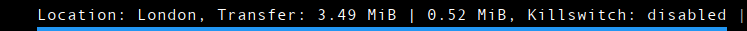

# NordVPN-polybar

## Overview
NordVPN-polybar is a simple BASH script designed to integrate NordVPN functionality directly into Polybar. This utility allows users to manage their VPN connection easily through Polybar, including displaying connection status and controlling the NordVPN settings.

<div align=center>



<div align=left>

## Features
- Display current VPN status, including connection location and data transfer rates.
- Easy control of NordVPN connection directly from Polybar.
- Toggle Kill Switch function to enhance security.
- Customisable Polybar module for NordVPN.

## Installation Instructions

1. **Download the Script**: Clone or download the `nordvpn_polybar.sh` script from this repository.

```
git clone https://github.com/wdoyle123/nordvpn_polybar.git
```

2. **Script Placement**: Place the script in a directory of your choice, commonly `~/scripts/`.

```
cd nordvpn_polybar
mv nordvpn_polybar ~/scripts/
```

3. **Make the Script Executable**:

```
chmod +x nordvpn_polybar.sh
```

4. **Install NordVPN**: Make sure you have NordVPN installed on your system. You can install it from NordVPN's official website or your distribution's package manager.

5. **Configure Polybar Module**: Edit your Polybar configuration file to include the nordvpn module. Example configuration:

```
[module/nordvpn]
type = custom/script
exec = ~/scripts/nordvpn_polybar.sh
interval = 1
format-underline = #2196f3
label = %output%
click-left = nordvpn connect France
click-middle = ~/scripts/nordvpn_polybar.sh toggle
click-right = nordvpn disconnect
```


## Usage
- **Display VPN Status**: The script will display your current VPN status on your Polybar.
- **Connect/Disconnect VPN**: Left-click on the Polybar module to connect to NordVPN (e.g., to France) and right-click to disconnect.
- **Toggle Kill Switch**: Middle-click on the Polybar module to toggle the Kill Switch on or off.

## Script Details
- `display_status`: Function to display the current status of the VPN connection.
- `toggle_killswitch`: Function to toggle the NordVPN Kill Switch.
- The script uses the `case` statement to handle different actions based on user input.

## Dependencies
- NordVPN: The script requires NordVPN to be installed on your system.
- Polybar: Designed for use with Polybar on Linux systems.
- Bash: This script is written for Bash shell.

## License
see the [LICENSE](LICENSE) file for details.

